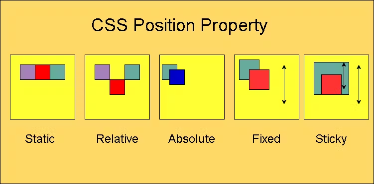
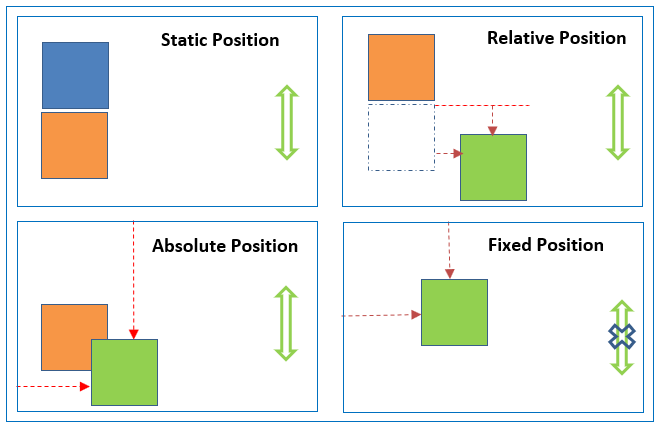
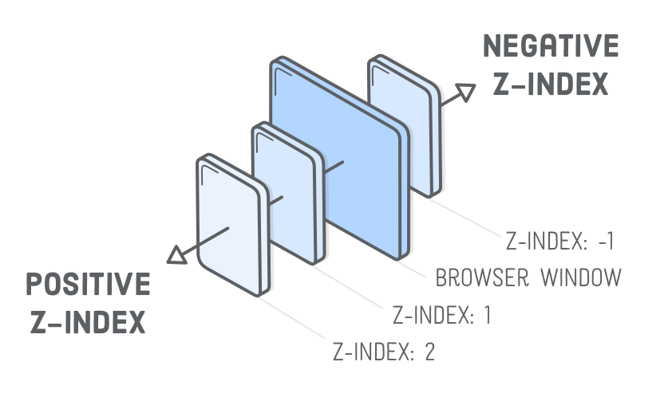

### lesson-18

##### Position

- static   -> top , left :  default holat

- relative  -> o'z o'rniga ega 
- absolute  -> o'z o'niga ega va parentga eng yaqin joylashishni taminlaydi
 qachonki parentda relative holat bo'lsa.
- sticky -> scroll vaqtida o'z postion holatini saqlaydi
- fixed -> absolute+sticky=fixed

- z-index 

- [ top , right , bottom , left ]

- overflow
- overflow-x
- overflow-y
- visible , hidden , scroll

