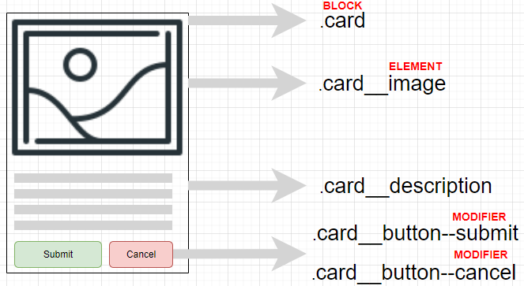
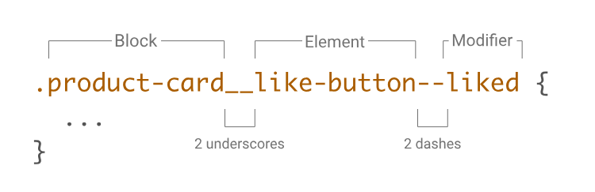

### lesson-19

- Normalize.CSS | all rest defaults properties +
- Prefix CSS 
- Minfire CSS 
- BEM  ( Block , Element , Modified)

- Amaliyot 

- Prefix Code : https://autoprefixer.github.io
- Minfire Code: https://www.toptal.com/developers/cssminifier
- Extra: https://shouldiprefix.com