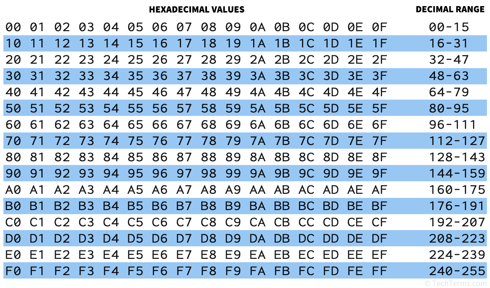
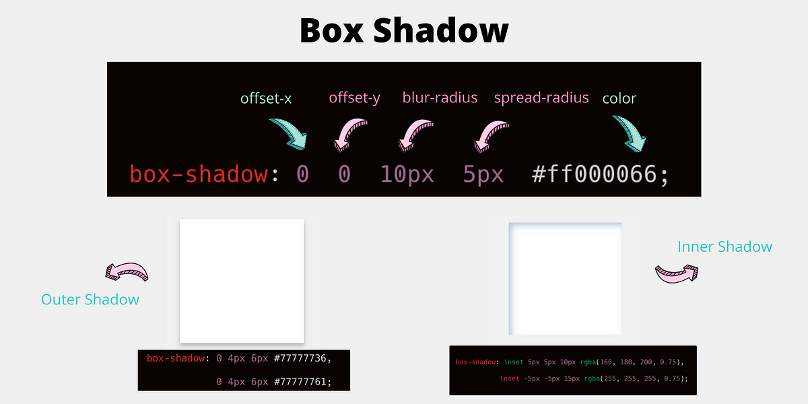

### LESSON (2 , 3)

- style attribute
- CSS ga kirish
- text property
- div vs span (block element vs inline element , etc ...) 

- ### text

- global : none | unset | inherit |

- text-align: center | left | right | justify
- text-decoration:  oveline | underline | line-through 
- text-transform: uppercase | lowercase | capitalize
- text-indent: px , rem , % , vw , units
- text-shadow: x , y , spread ,  opacity;


- ### font
- font-size: px , rem , etc...  units
- font-weight: 100, 200, ... 900; (lighter , bold=700 , bolder=900 , normal=500)
- font-family: monospace; serif , sans-serf , fantasy , cursive
- font-style: italic; bold; normal
... etc

- ### letter / word

- letter-spacing: by default (3px , 4px) , px , rem , em , % .. etc
- word-spacing: by default (12px , 14px) , px , rem ...
- line-height: px , % , rem ...

- ### colors

- RGB         -> ( red, green, blue , alpha) max-value: 255
- HEX         -> Hexadecimal     
- HSL         -> 
- RGB (alpha) 
- naming color: red, GreeN, blue , white




- ### Units

- width: kengligi 
- height: balandligi

- max-width: eng ko'p bilan kengligi
- min-width: eng kamida kengligi

- max-height: balandligi
- min-height: balandligi


- ### background

- background-color: rgb , hex , hsl  , ... etc

- background-image: url("source.png") / linear-gradient / radial-gradient
- background-size: cover , contain , (x:%|px|rem , y: %| px | rem);
- background-repeat: no-repet , repeat-x , repeat-y ,  repeat;
- background-attachment: fixed , scroll , ... etc

- background: url("source.png") , cover , no-repet; color

- ### CSS - selectors

- tag
- .class
- #id


- name
- attribute
- data-set
- type


``` 
for example in selector : tag , class , id

selector {
    property1: value1;
    property2: value2;
    property3: value3;
}

```


## Lesson-4

## CSS connection

- inline
- internal 
- external

#### Display

- block 
- inline
- inline-block -> w , h -> support  

- flex
- grid 
- inline-flex
- table 
- etc...


#### Box-model

- content 
- border
- padding
- margin

- outline


#### Box-sizing
- box-sizing: border-box , content-box

#### Universl class / CSS boilerplate

```
*{
    property: value;
    property: value
}

```


##### extra properties

- border-radius
- box-shadow:+- x , +-y , blur , opacity , spread 




