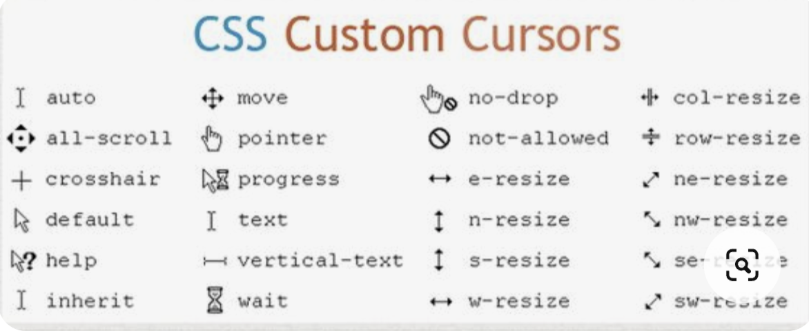
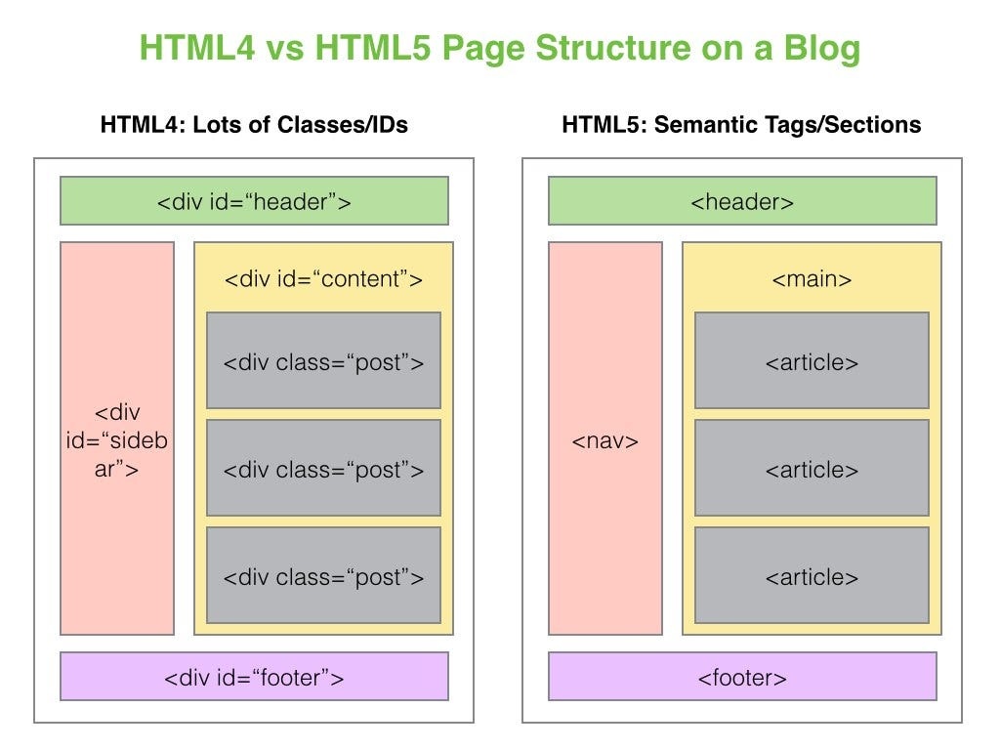

### Lesson-5

(Box-model , Box-shadow , Border , Box-sizing)

- Pseudo classes
- Transition
- class  rules
- Sematic tags
- data structures
- containers


 ##### Pseudo classes

```
selector{
    property:value;
}

selector:hover{
   property:value; 
}


```

##### Transition 


```
.className{
    transition-duration: 1s;
    transition-delay: 1s;
    transition-timing-function: ease;
    transition-property: all or color , background , etc ...
    <!-- shorthand -->
    transition: all 1s ease 1s ;
}
```

##### Sematic tags

- header
- main
- section
- footer
- nav 
- aside
- article
.
.
... etc


 ##### Container

 ```
.container{
    max-width: device-width or prject  / 1250px
    margin: 0 auto;
    padding: 0 20px;
}
 ```




