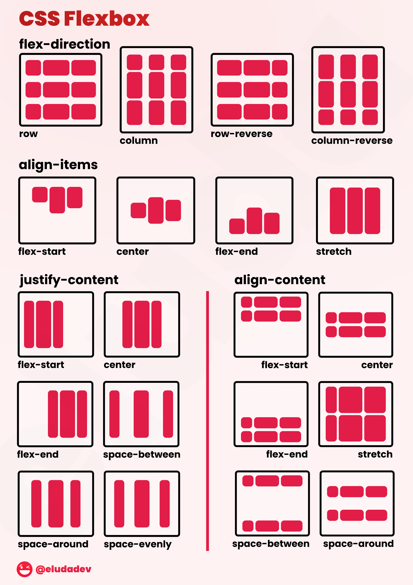

### Lesson-13 

- Folder structure +
- Layout ? +
- Documentation +
- Fonts + (global)
- Float +
- Flex box + ( Flex containe )

- Flex box : games 
- https://flexboxfroggy.com
- https://codingfantasy.com/games/flexboxadventure/play


```
        display: flex;
        justify-content:space-around;
        align-items:center;
        flex-direction: row-reverse;
        flex-wrap: wrap;
```

