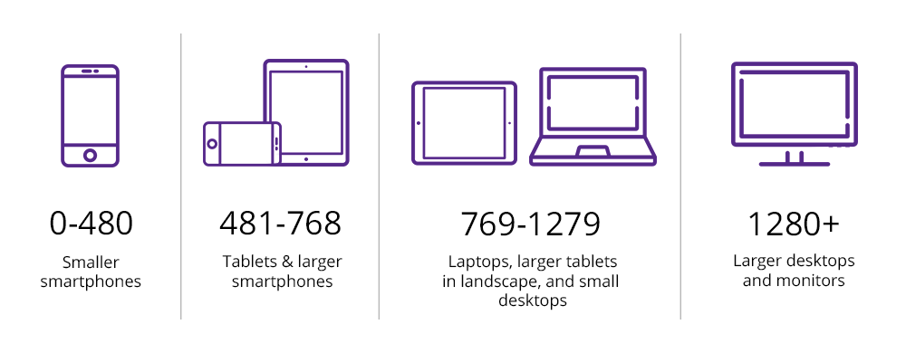

### Responsive web design

1. Media queries               ->
2. Mobile first & Desktop first 
3. Breakpoints                 -> device  max-width [375 , 768 , 992 , 1250+ , 1280+]
4. screen types -> 


#### Desctop first -> max-width
#### Mobile first -> min-width


###### break points



##### icon package: boxIcon , Bootstrap Icon
1. https://boxicons.com
```
<link href='https://unpkg.com/boxicons@2.1.4/css/boxicons.min.css' rel='stylesheet'>

```
##### extra:  Variables


