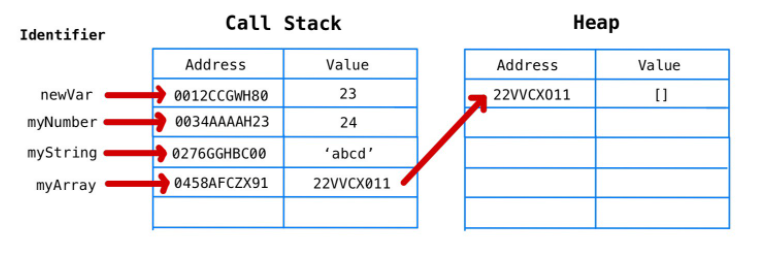

## JAVASCRIPT

- JS Syntax
- Data types
- Variables
- Operators
- Scopes 


##### Data types

> Primative

1. String
2. Number
3. Boolean
4. Undefined
5. Null
6. bigInt
7. Symbol

> Non Primative


1. Object



(Array , Function , Map , SET , ...etc)

<code> String </code>
```
"Hello, world!"
'Goodbye, world',
`Hi everyone`

"12222"
'122211'
`0.77`

```

```
` " O'tkan kunlar " romani `
```
<code>Number</code>

```
1 , 23 
-12
32
3,
4,
3/41
0.322121

```
<code> Boolean </code>


```
<!-- 10==10  -->

// true

<!-- 9=="9" -->

// true

<!-- 33==="33" -->

// false

```


### Variables

- var 
- let 
- const

```

1. var myName = "Mukhriddin"; (camel sace) +
2. <!-- var my-name = "Mukhriddin" (kebeab case) -->
3. var MyName = " Mukhriddin" (paskal case) +

```


- Math Operators

+
-
/
*
%

**

++ INCREMENT

-- DICREMENT

### NAN -> NOT A NUMBER

let a=8;
let b=32;

a=a+b;
a+=b;
a*=b;
a-=b;

a/=b;
a=a/b

##### O'zlashitirish 

+=
-=
*=
/=
%=
**=

##### Taqqoslash

< 
>
>=
<=
==
===
! 
!=
!==


