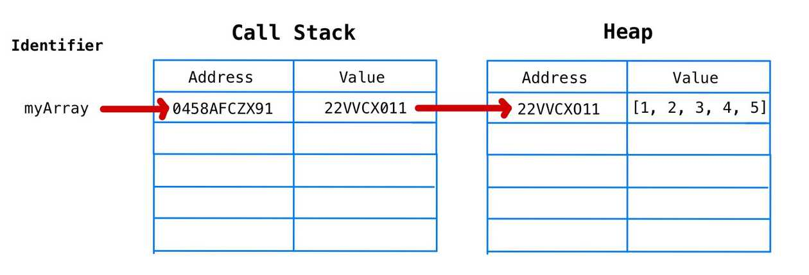
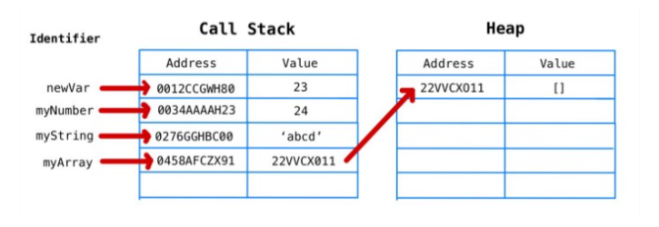

### lesson-9
- ###  data type
- #### primative
- string
- number
- boolean
- undefined
- null
- symbol
- bigInt
- #### non primative
- object


### Memory Usage JS




```
const id=new Symbol("123abc");
const index=new Symbol("123abc");

if(id===index){
    console.log(true)
}else{
    console.log(false)  
}


const bigNumber=BigInt(123456789n)

```
## - Variables
- var 
- let 
- const
## - Comparision operators
- ==
- ===
- >
- < 
- >=
- <=

## - Assignment operators
- +=  a=a+b -> a+=b;
- -=
- *=
- /=
- %=
- **=

## - Conditional operators
- if else , switch , ternary (? ) , nullish colasing ?? 

```

if(n%2==0){
   alert("juft son")
}else if(n==0){
   alert("juft, toq emas")
}else{
   alert("toq son")
}

let state=2;

switch(state){
    case 1: alert("One") ; break ;
    case 2: alert("Two") ; break ;
    case 3: alert("Three"); break;
    default: alert("no where");
}

```


## - Truthy vs Falthy values
- ###### Falthy
- ""
- null
- undefined
- 0
- false
- NaN

- ###### Truthy
- 1
- true
- 'Salom'
- etc

## - Logical operators
- && , || , ! , 
## - Type Conversion
- String(number) // typeof string
- Boolean("") // typeof boolean
- Number('string') // typeof number
## - Number , String , Boolean
new Number() , new String() , new Boolean()
## - Loops
- do while , while , for ,
- ( for of , for in)

```
let n=1;

do{
    console.log(n);
    n++;
}while(n<20)

while(n<20){
    console.log(n);
    n++
}

for(let g=0; g<100; g++){
    if(g){
       console.log(g);
    }else{
      console.log("false");
    }
}

```

## - Functions

### Function Decloration

```
function darkMode(){

  console.log("Dark Mode changed");
   
}

darkMode()


```


